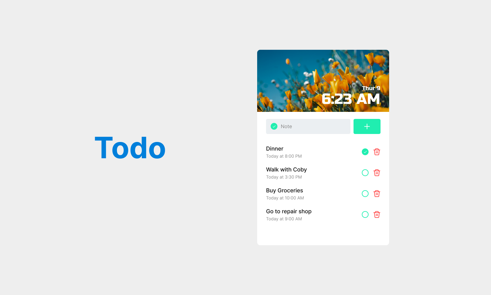

# Todo-UI

### Table of Contents

- [Prerequisites](#Prerequisites)
- [Tech Stack](#Tech-Stack)
- [Screenshot](#Screenshot)
- [Getting Started](#Getting-Started)
- [Project Structure](#Project-Structure)
- [Deployment](#Deployment)
- [Author](#Author)

### Prerequisites

-  _npm @8 and up_
-  \_javascript es6
-  \_vite @4.0.0

#

### Tech Stack

-  _ReactJS @18.1.0 - frontend framework_
-  _Tailwind CSS v3.0 - visual primitives for the component age_

### Interaction

Users should be able to:

- See hover states for all interactive elements on the page
- Add new todos to the list
- Mark todos as complete
- Delete todos from the list

### Screenshot



### Links

- Solution URL: [Add solution URL here](https://github.com/DavitDvalashvili/Todo-UI)
- Live Site URL: [Add live site URL here](https://todo-app-ui-seven.vercel.app/)

### Getting Started

1. First of all you need to clone app repository from github:

```
git clone https://github.com/DavitDvalashvili/Todo-UI.git
```

2. Next step requires install all the dependencies.

```
npm install
```

3. To see project in action

```
npm run dev
```

#

### Project Structure

```
|--- src
| |--- components # reusable components
| |--- App.jsx # main page
| |--- index.css # global styles

- package.json # dependency manager configurations
- tailwind.config.js # CSS configuration
- vite.config.js # fast build tool
```

#

### Deployment

Before every deployment you need to create build file.

```
npm run build
```

after this you can use this file to deploy project on server.

#

### Author

- Github profile - [Add your name here](https://github.com/DavitDvalashvili)
- Linkedin profile - [Add your name here](https://www.linkedin.com/in/davit-dvalashvili-0421b6253)
- Email - [@your_username](davitdvalashvili1996@gmail.com)
